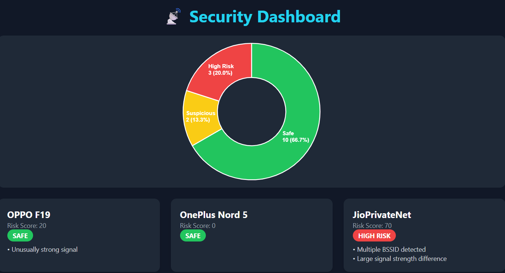
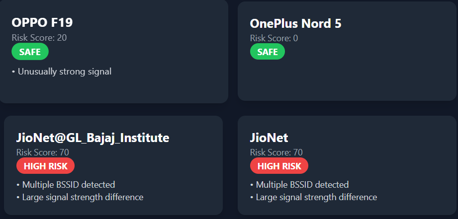

# 📡 WiFi Evil Twin Detection System

## 🚀 Overview
A cybersecurity tool that detects potential Evil Twin WiFi attacks by analyzing nearby wireless networks using signal anomalies and BSSID duplication.

## 🧠 Features
- Detects duplicate SSIDs
- Identifies multiple BSSIDs
- Signal strength anomaly detection
- Risk scoring engine
- Real-time scanning
- Interactive web dashboard
- Alerts for HIGH RISK networks
- Data visualization using charts

## 🛠️ Tech Stack
- Python (Flask)
- PyWiFi
- HTML + Tailwind CSS
- Chart.js

## ⚙️ How It Works
1. Scans nearby WiFi networks
2. Groups networks by SSID
3. Applies detection rules:
   - Multiple BSSID
   - Strong signal anomalies
   - Signal difference
4. Assigns risk score
5. Displays results in dashboard

## ▶️ Run Locally

```bash
pip install -r requirements.txt
python app.py
## 📸 Screenshots

### 🖥️ Dashboard View


### ⚠️ Risk Detection Example
